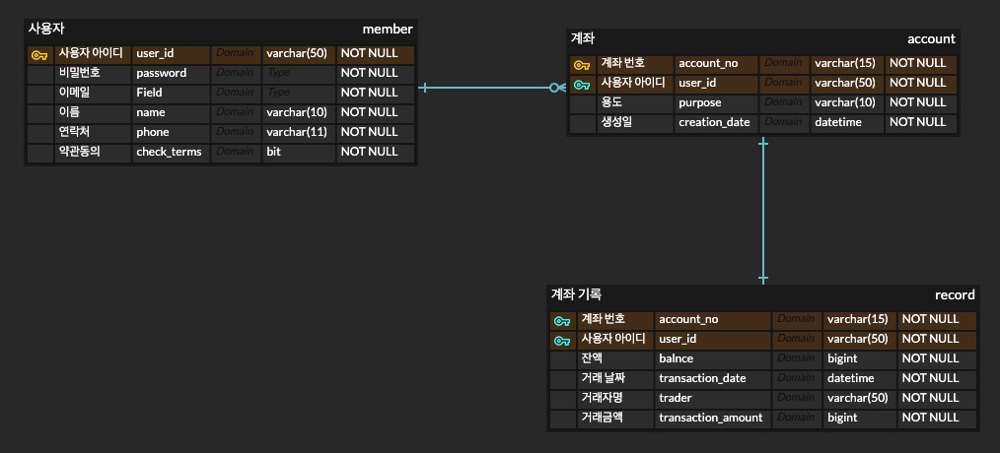

# fin_zb
## 핀테크 프로젝트

계좌를 생성/삭제할 수 있고 입출금과 송금을 다루는 뱅킹 서비스입니다.

# 프로젝트 기능 및 설계
- 계좌 검색 기능
- 계좌 관리 (생성/삭제, 금액 인출, 금액 입금)
- 송금 기능 및 송금 이력 조회
- 로그인/로그아웃에 따른 계좌 접근 허가 기능 구현

# 기능별 설명
## 회원가입 기능
- 사용자는 자체 회원가입을 할 수 있다.
- 이름, 이메일, 전화번호, 아이디, 비밀번호를 입력해야하며 전체 약관 동의를 해야 한다. 이 때, 아이디와 이메일은 UNIQUE값이다.
- 회원가입 진행 시 이메일 인증을 받아야 한다.

## 로그인 기능
- 사용자는 아이디와 비밀번호를 이용하여 로그인을 할 수 있다.
- 사용자는 로그인을 했을 때만 계좌 검색, 계좌 관리 등 다른 기능을 사용할 수 있다.
- 로그인 실패시 이름과 전화번호를 입력하여 아이디 찾기 기능을 사용할 수 있다. (**로 일부만 알려주기)

---
## 계좌 관리
### 계좌 생성
- 사용자는 로그인 후 계좌를 생성할 수 있다.
- 계좌는 약관을 동의하고 통장 비밀번호 설정(비밀번호 확인까지 두 번 진행)과 사용용도를 설정하면 생성할 수 있다.
- 계좌 생성 성공 시, 계좌는 3333-xx-xxxxxxx (13자리)로 고정이며, 오름차순으로 자동 생성된다. (레퍼런스 : 카카오뱅크)
- 계좌 번호는 UNIQUE 해야 한다.
- 한 사람당 만들 수 있는 계좌의 수는 5개로 제한한다.

### 계좌 삭제
- 사용자는 로그인 후 계좌 조회 완료 후 계좌 조회 화면에서 계좌를 삭제할 수 있다.
- 계좌 삭제를 요청했을 때 다시 한 번 회원 비밀번호를 요구하고 일치하면 진행한다.
- 통장 비밀번호 요청을 하고 한 번 더 확인했을 때도 일치하면 마지막 경고 문구가 나온다. 
  이 때, 삭제를 선택하면 계좌를 삭제한다.
- 만약 계좌에 잔액이 남아있는 경우 계좌는 삭제 요청은 실패한다. (계좌를 삭제할 수 없다.)

---
## 계좌 조회 및 입출금

### 계좌 조회
- 사용자는 로그인 시 조회 메뉴를 선택하여 본인 소유의 모든 계좌를 확인할 수 있다.
- 이 때, 계좌는 (계좌 사용 목적 | 계좌 번호 ) 형식으로 보이게 된다.
- 사용자는 계좌 선택 시 잔액, 송금 내역을 확인할 수 있다.
- 송금, 입금, 출금 기능을 선택하여 사용할 수 있다.

### 입금
- (입금은 사용자가 입금했다는 가정하에 진행한다.)
- 사용자는 로그인 상태에서 계좌 조회 후 계좌를 선택해서 입금을 진행할 수 있다.
- 금액 입력 후 진행하면 통장 비밀번호 확인 후 입금 작업이 진행된다.
- 입금 성공 시 잔액은 변동된다.
- (변동된 잔액은 바로 화면에서 확인할 수 있다.)

### 출금
- (출금은 사용자가 출금한다는 가정하에 진행한다)
- 사용자는 로그인 상태에서 계좌 조회 후 계좌를 선택하여 출금을 진행할 수 있다.
- 금액 입력 후 진행하면 통장 비밀번호 확인 후 출금 작업이 진행된다.
- 출금 금액보다 잔액이 적을 경우 출금 작업에 실패한다. 이 경우 잔액은 변동이 없다.
- 출금 작업이 무사히 완료되면 잔액은 변동된다.

---
## 송금
- 사용자는 로그인 상태에서 계좌 조회 후 계좌를 선택하여 송금을 진행할 수 있다.
- 송금 계좌를 입력하면 계좌 주인의 이름이 뜬다. 맞는지 확인 과정을 거친 후 맞을 경우 다음 스텝을 진행한다.
- 금액을 입력한다. 금액 확인 창이 뜨고 통장 비밀 번호를 입력하면 송금이 진행된다.
- 송금 금액이 현재 선택한 계좌의 잔액보다 크면 송금에 실패한다. 이 경우 잔액은 변동 없다.
- 송금에 성공할 경우 변동된 잔액을 화면에서 확인할 수 있다.

---
## 관리자 (추가사항)
- 페이지를 관리하는 사용자가 따로 존재한다. 일명 관리자라고 칭한다.
- 관리자는 전체 고객(회원가입자)수를 확인할 수 있다.
- 관리자는 고객의 정보를 확인할 수 있다.
- 이 때, 확인하는 정보는 이름, 아이디, 이메일, 전화번호, 계좌 수로 제한한다.

---
# ERD

member 테이블과 account 테이블은 (1:N) 관계를, account 테이블과 member 테이블은 (N:1) 관계이다. 
account 테이블과 record 테이블은 (1:1) 관계로 ERD를 작성하였다.

사용자 아이디(pk)를 통해 계좌를 생성 및 접근할 수 있고 각 계좌마다 입출금, 송금 기록을 저장할 record 테이블에 (1:1)로 연결되어 있다.
이 때, 계좌 번호를 통해 기록에 접근하도록 한다.

(<U>송금시 본인 계좌 잔액과 상대방 계좌 잔액이 바뀌고 상대반 계좌에도 기록이 남아야 하는데 현재 이 테이블로는 불가능할 것 같습니다.
송금 작업시 상대방 계좌번호를 이용해 account 테이블로 접근하고 외래키를 이용해 record 테이블에 접근해서 잔액을 변경할 수 있을 것 같기도 합니다.</U>)
 
---
# 사용기술 스택
  

- Java
- Spring DATA JPA
- Git

